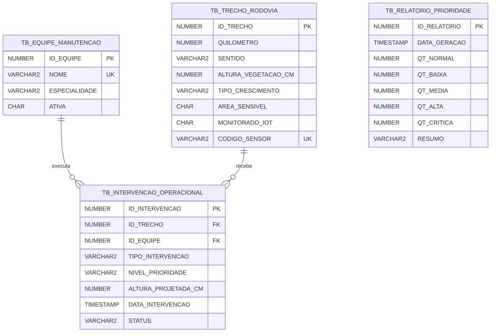

# MOTIVA - Sprint 03

Aplicacao academica em Java que evolui o motor de priorizacao de manejo de vegetacao da Sprint 02 com persistencia em Oracle Database por JDBC puro. O sistema cadastra e consulta equipes e trechos, registra intervencoes, executa as regras operacionais existentes e mantem o historico dos relatorios.

## Integrantes

| Nome | RM |
|---|---|
| Joao Victor Alves de Abreu | 564946 |
| Luiz Henrique Barbosa Dias | 562399 |
| Rodrigo Kenshin Viana Matayoshi | 564026 |


## Visao Geral

A Sprint 03 substitui a massa simulada do fluxo principal por dados persistidos no Oracle, sem trocar a arquitetura orientada a objetos criada anteriormente. JDBC permanece explicito: conexoes, `PreparedStatement`, `ResultSet`, mapeamentos e fechamento de recursos podem ser demonstrados diretamente.

## Evolucao da Sprint 02

A Sprint 02 continua presente e funcional:

- `TrechoRodovia` preserva encapsulamento e validacoes;
- `TrechoMonitoradoIoT` continua herdando de `TrechoRodovia` e implementando `MonitoravelViaIoT`;
- `IntervencaoOperacional` permanece abstrata, com `RocadaManual`, `RocadaMecanizada` e `Pulverizacao` como implementacoes polimorficas;
- `MotorRegrasPrioridade` continua sendo a unica fonte das regras de classificacao;
- `ResultadoPrioridade` e `RelatorioPrioridade` continuam representando e imprimindo o resultado operacional.

Os novos records existem somente na fronteira de persistencia. Nenhuma classe do dominio depende de JDBC ou de DAO.

## Objetivo

- executar CRUD completo das quatro entidades da Sprint 03;
- reconstruir trechos comuns e IoT a partir do banco;
- analisar os trechos persistidos com o motor da Sprint 02;
- gravar o resumo de cada relatorio;
- gravar as intervencoes planejadas, vinculadas a trechos e equipes;
- demonstrar o fluxo completo no `Main`.

## Tecnologias

- Java 17 ou superior;
- Oracle Database 12c ou superior para as colunas `IDENTITY` utilizadas nos scripts;
- JDBC puro (`java.sql`);
- Oracle JDBC Driver `ojdbc17.jar`;
- IntelliJ IDEA ou terminal.

Nao sao utilizados Spring, JPA, Hibernate, ORM, Maven ou Gradle.

## Arquitetura

```text
Oracle
  -> ConexaoBD
  -> DAOs
  -> records de persistencia
  -> dominio da Sprint 02
  -> MotorRegrasPrioridade
  -> ResultadoPrioridade[]
  -> RelatorioPrioridade (console)
  -> GeradorRelatorio
  -> historico e intervencoes no Oracle
```

`GeradorRelatorio` orquestra o caso de uso. O relatorio e as intervencoes geradas na mesma analise usam DAOs presos a uma unica conexao transacional: uma falha provoca `rollback` do conjunto sem reconexao silenciosa.

## Estrutura de Pacotes

```text
motiva-sprint02-poo/
|-- config/
|   `-- db.properties.example
|-- lib/
|   `-- README.md
|-- sql/
|   |-- seu-script-criacao.sql
|   `-- seu-script-dados.sql
`-- src/br/com/motiva/
    |-- Main.java
    |-- dao/
    |   |-- EquipeManutencaoDAO.java
    |   |-- IntervencaoOperacionalDAO.java
    |   |-- RelatorioPrioridadeDAO.java
    |   `-- TrechoRodoviaDAO.java
    |-- db/
    |   `-- ConexaoBD.java
    |-- intervencao/
    |-- iot/
    |-- model/
    |   `-- persistence/
    |       |-- EquipeManutencaoRecord.java
    |       |-- IntervencaoOperacionalRecord.java
    |       |-- RelatorioPrioridadeRecord.java
    |       `-- TrechoRodoviaRecord.java
    |-- service/
    |   |-- GeradorRelatorio.java
    |   |-- MotorRegrasPrioridade.java
    |   |-- RelatorioPrioridade.java
    |   `-- ResultadoPrioridade.java
    `-- util/
```

## Modelo de Dados



## Tabelas Oracle

- `TB_EQUIPE_MANUTENCAO`: equipes, especialidades e estado ativo/inativo;
- `TB_TRECHO_RODOVIA`: dados do trecho e discriminador para reconstruir `TrechoMonitoradoIoT`;
- `TB_INTERVENCAO_OPERACIONAL`: historico operacional com FKs para equipe e trecho;
- `TB_RELATORIO_PRIORIDADE`: contagens e resumo de cada execucao do motor.

As constraints validam valores nao negativos, enums do dominio, flags `S/N`, coerencia entre IoT e codigo do sensor e contagens do relatorio. As FKs nao usam exclusao em cascata: dados relacionados nao sao removidos silenciosamente.

## Relacionamentos

Uma equipe pode executar varias intervencoes e um trecho pode receber varias intervencoes. O historico de relatorios representa uma execucao agregada do motor e nao substitui as intervencoes individuais.

## Configuracao do Oracle

Defina uma URL Thin no formato:

```text
jdbc:oracle:thin:@//host:porta/servico
```

Os scripts usam `GENERATED BY DEFAULT AS IDENTITY`, disponivel no Oracle 12c+. A versao do ambiente FIAP deve ser confirmada antes da apresentacao. Em uma instalacao anterior ao 12c, substitua as colunas identity por sequences e use `NEXTVAL` nos inserts; essa alternativa nao foi declarada como testada neste repositorio.

## Configuracao do ojdbc17

O driver nao e distribuido neste repositorio. Obtenha o `ojdbc17.jar` de uma fonte Oracle autorizada e copie para:

```text
motiva-sprint02-poo/lib/ojdbc17.jar
```

O modulo IntelliJ ja referencia esse caminho. Instrucoes adicionais estao em `motiva-sprint02-poo/lib/README.md`.

## Variaveis de Ambiente

Credenciais reais nunca devem ser commitadas. `ConexaoBD` procura primeiro estas variaveis de ambiente:

- `DB_URL`;
- `DB_USER`;
- `DB_PASSWORD`.

PowerShell:

```powershell
$env:DB_URL = "jdbc:oracle:thin:@//host:1521/servico"
$env:DB_USER = "seu_usuario"
$env:DB_PASSWORD = "sua_senha"
```

Linux/macOS:

```bash
export DB_URL='jdbc:oracle:thin:@//host:1521/servico'
export DB_USER='seu_usuario'
export DB_PASSWORD='sua_senha'
```

Como alternativa local, copie `config/db.properties.example` para `config/db.properties`. O arquivo real e ignorado pelo Git, e as variaveis de ambiente sempre tem precedencia sobre ele.

## Como criar o banco

Conecte-se ao schema academico e execute, nessa ordem:

```sql
@sql/seu-script-criacao.sql
@sql/seu-script-dados.sql
```

O cabecalho do script de criacao documenta os quatro comandos opcionais de reset em ordem filha-primeiro. Eles ficam comentados e nao fazem parte do fluxo normal. Para uma reapresentacao, confirme o schema conectado, preserve os dados necessarios e execute conscientemente o reset antes de recriar as tabelas.

## Como inserir dados

`seu-script-dados.sql` cadastra:

- Equipe Alpha, Equipe Beta e Equipe Preventiva;
- seis trechos, dos KM 10 a 15;
- tipos de crescimento seco, normal e umido;
- areas sensiveis e nao sensiveis;
- dois trechos IoT;
- intervencoes coerentes com o motor;
- um relatorio inicial com `NORMAL=1`, `BAIXA=0`, `MEDIA=1`, `ALTA=2` e `CRITICA=2`.

O script termina com `COMMIT`.

## Como executar no IntelliJ

1. Abra a raiz do repositorio.
2. Acesse `File -> Project Structure -> Modules -> Dependencies`.
3. Se a dependencia nao for reconhecida automaticamente, clique em `+ -> JARs or Directories`.
4. Selecione `motiva-sprint02-poo/lib/ojdbc17.jar`.
5. Configure as tres variaveis de ambiente na Run Configuration.
6. Execute `br.com.motiva.Main`.

## Como executar no terminal

Entre no diretorio `motiva-sprint02-poo` e crie a saida local.

Windows PowerShell:

```powershell
$fontes = Get-ChildItem -Recurse -Filter *.java src | ForEach-Object { $_.FullName }
javac --release 17 -encoding UTF-8 -cp "lib/ojdbc17.jar" -d out $fontes
java -cp "out;lib/ojdbc17.jar" br.com.motiva.Main
```

Linux/macOS:

```bash
find src -name "*.java" > sources.txt
javac --release 17 -encoding UTF-8 -cp "lib/ojdbc17.jar" -d out @sources.txt
java -cp "out:lib/ojdbc17.jar" br.com.motiva.Main
```

O separador de classpath e `;` no Windows e `:` no Linux/macOS.

## CRUD implementado

Todos os DAOs possuem construtor padrao e os metodos `inserir`, `buscarPorId`, `listarTodas`, `atualizar` e `deletar`. O `Main` demonstra o CRUD com registros temporarios e exclui somente esses registros ao final da demonstracao. Os dados principais da massa nao sao destruidos.

Metodos adicionais:

- `EquipeManutencaoDAO.buscarPorNome` resolve a equipe operacional sem IDs fixos;
- `TrechoRodoviaDAO.listarComoDominio` reconstrui a hierarquia da Sprint 02;
- `RelatorioPrioridadeDAO.salvarRelatorio` explicita a gravacao do historico.

## Persistencia dos Relatorios

O gerador recebe os trechos persistidos, executa `MotorRegrasPrioridade`, imprime com `RelatorioPrioridade`, contabiliza os cinco niveis do enum e grava o resumo. `BAIXA` e persistida e contabilizada, embora as regras atuais da Sprint 02 nao produzam essa classificacao.

Resultados com `SEM_INTERVENCAO` nao geram uma linha operacional. As demais intervencoes sao gravadas como `PLANEJADA` e usam a altura projetada calculada pelo motor, inclusive o adicional de area sensivel.

## Tratamento de Excecoes

- erros de banco permanecem como `SQLException` e sao exibidos com mensagem clara;
- dados invalidos geram `IllegalArgumentException` nos limites de dominio/persistencia;
- statements e result sets usam `try-with-resources`;
- a conexao compartilhada e fechada no `finally` do `Main`;
- falhas na gravacao conjunta provocam `rollback`.

## Seguranca com PreparedStatement

Todas as consultas parametrizadas usam `PreparedStatement`. Nao ha concatenacao de entrada em SQL, logging de senha ou credenciais versionadas. `.env` e `db.properties` sao ignorados pelo Git.

## Exemplo de Execucao

```text
============================================================
MOTIVA - SPRINT 03
Persistencia Oracle + JDBC
============================================================

[1] TESTANDO CONEXAO
Conexao com Oracle realizada com sucesso.

[2] CRUD EQUIPES
...

[5] GERANDO RELATORIO
RELATORIO DE PRIORIDADE OPERACIONAL - MOTIVA
...

[6] HISTORICO DE RELATORIOS
...
```

O CRUD Oracle e os scripts devem ser validados em uma instancia Oracle real. Compilacao local sem driver nao comprova conexao, constraints, FKs ou transacoes.

## Regras de Prioridade Preservadas

| Altura projetada | Intervencao | Prioridade |
|---|---|---|
| menor que 40 cm | Sem intervencao | NORMAL |
| de 40 a 59,99 cm | Pulverizacao preventiva | MEDIA |
| de 60 a 89,99 cm | Rocada manual | ALTA |
| a partir de 90 cm | Rocada mecanizada | CRITICA |

Areas sensiveis recebem o adicional operacional de 10 cm. Trechos IoT fornecem a altura pelo contrato `MonitoravelViaIoT`.

## Conceitos de POO da Sprint 02

- classe abstrata e especializacoes de intervencao;
- interface para monitoramento IoT;
- heranca de trecho monitorado;
- polimorfismo na execucao das intervencoes;
- encapsulamento e validacao de estado;
- motor de regras isolado da persistencia.
